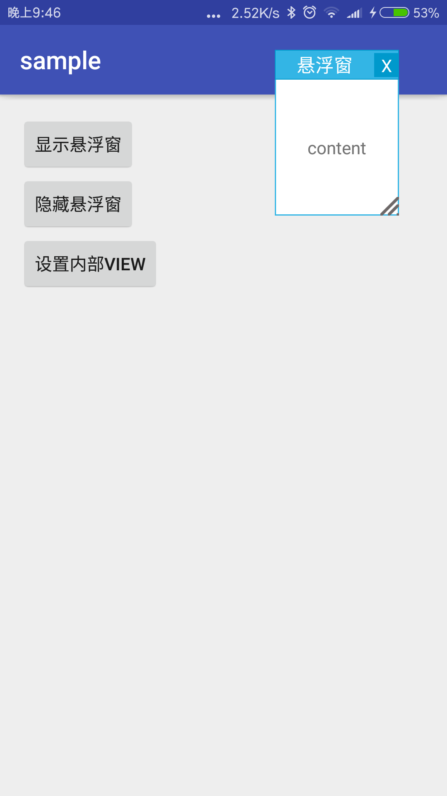

# FloatingWindow
Android FloatingWindow
 
悬浮窗
 
用于显示一个悬浮窗
 
这个工程包含一个示例 sample 和一个 library
 
sample 演示了 FloatingWindow的使用方法.
 

当前版本:1.0
功能概述:
  可拖动标题栏移动窗口位置
  可拖动窗口右下角动态调整窗口大小
  可设置窗口大小,标题文本,颜色,背景
  可设置窗口内容View
  可设置窗口尺寸变化监听器
  点击右上角关闭按钮关闭窗口
 
 

